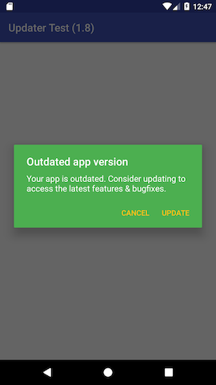
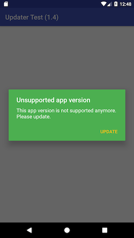
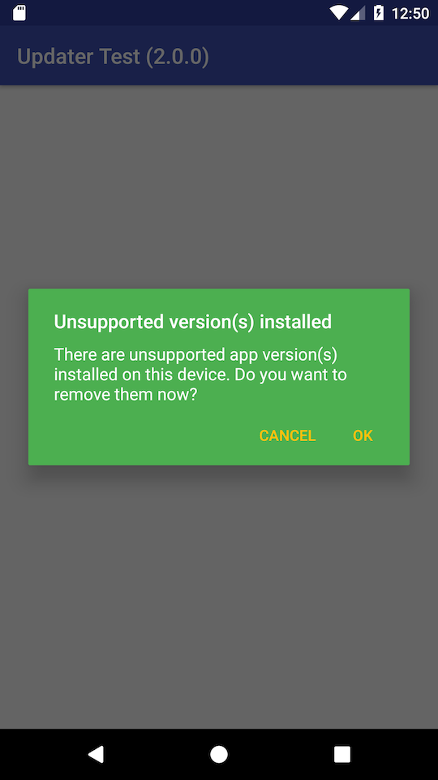

# Updater

Have you ever needed to remotely inform users about new app version from within your app?

Or maybe you wanted stop supporting some old versions & make sure that users will update to the latest one?

Or even wanted to retire one package in favor of another one and migrate users?

If your answer is YES, then you are in the right place!

## Features

 * Remote app version outdating and deprecating
 * Remote users migration between two different application IDs

## Installation

To use the library, first include it your project using Gradle

    repositories {
        maven { url 'https://dl.bintray.com/mobiletoolkit/public' }
    }

	dependencies {
	    compile 'org.mobiletoolkit.updater:updater:2.0.0'
	}

## How to use

Check the *exampleapp* module for sample implementation.